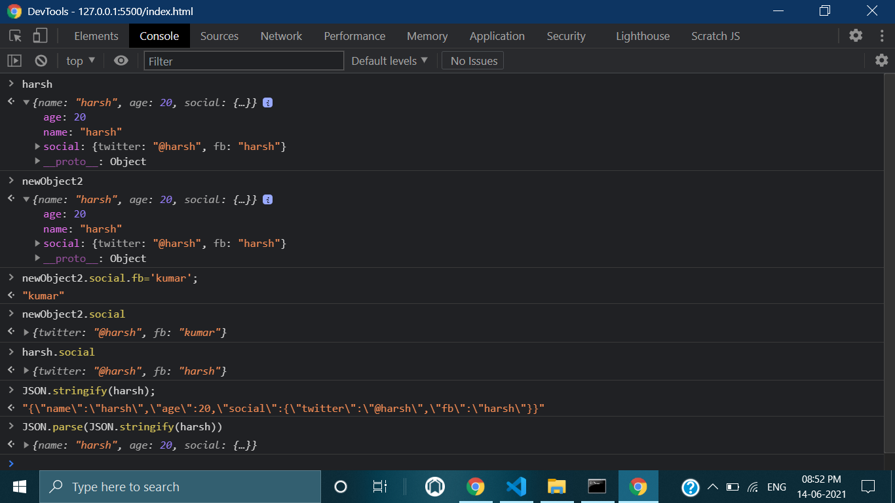

# JS-30-DAY-14

## <h1 align="center"> JavaScript References VS Copying <h1>

## [demo](https://cenacrharsh.github.io/JS-30-DAY-14/)

## [BLOG](https://dev.to/cenacr007_harsh/javascript-30-day-14-3p0i)

## Lessons Learned:
- Learned how to make copies of Arrays and Objects
